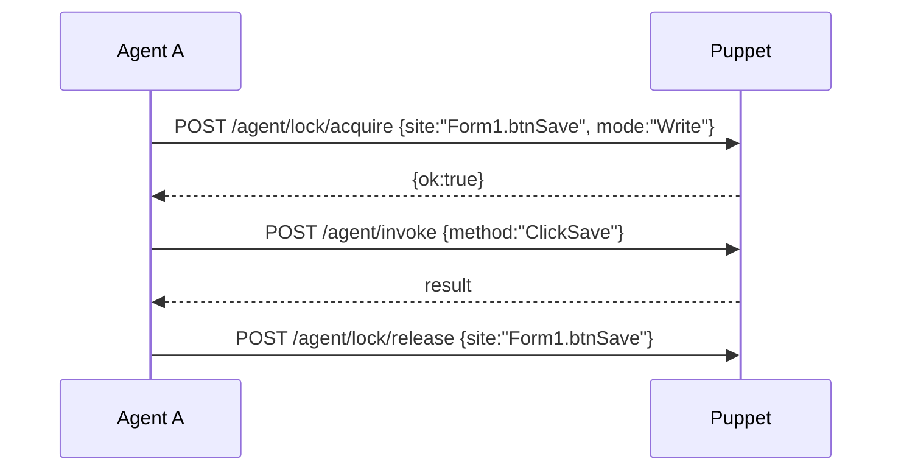

# Puppet.Core 开发指南（供 AI Agent 阅读）

> 本指南的阅读对象是 **AI Agent**，不是人类开发者。所有原则、边界、规范都以"Agent 如何高效、安全地使用并迭代此框架来调试宿主工程"为准绳。开始使用前先通读全篇。

## 库概述

* 名称：Puppet.Core

* 目标框架：net10.0

* 用途：为任意 .NET 类型（含 WinForm 窗体）提供 Agent 可操控的 WebApi 接口。通过反射自动生成能力描述，支持运行时状态查询与方法调用。

* 定位：**这是 agent 的工具，不是给开发者用的库**。代码不追求开发者友好性，只追求 agent 友好性。Agent 在使用中根据需要主动维护与迭代本框架。

## 依赖

* Wima.Core（Utils、Reflection、LogExtention）

* Wima.Log（独立库，仅引用；WimaLogger.LogBook、ILog）——本框架的日志体系即引入 WimaLogger

* Wima.Web.Engine（WebServerBase、WebRequest/Response）

* Newtonsoft.Json

## 子项目

* Puppet.Core：通用核心（接口、序列化、描述、注册表、Web 端点、内建 Web 服务器、使用日志）

* Puppet.Core.WinForms：WinForm 专用（控件树遍历、控件操作 Click/Text/Select）

* Puppet.Core.Console：Console 专用（进程状态、stdin/stdout）

## 核心接口

### IPuppet

* `string AgentAccessKey { get; }` — Agent 访问密钥

* `Common.Logging.ILog AgentLog { get; }` — 宿主实例日志（WimaLogger 实现 ILog，可直接返回）

* `string AgentInstanceName { get; }` — 实例唯一名

### 特性

* `[PuppetIgnore]` — 不暴露给 Agent 的成员（密钥/句柄/内部状态等）

* `[PuppetExpose("理由")]` — 显式暴露**非 public** 成员；public 成员默认已暴露，无需此特性

* `[PuppetDescription("描述")]` — 补充/覆盖描述

> 成员可访问规则：`public` 默认可访问；`non-public` 需 `[PuppetExpose]` 才可被调用/读取。`[PuppetIgnore]` 优先级最高，任何情况下都不暴露。

### 枚举

* `DescribeFormat` — Json / Markdown

* `InfoSource` — Reflection / HumanSummary / PuppetDescription（描述信息可靠性）

## 集成模式

### 模式 A：极简注入（宿主已有 WebServerBase 子类）—— 推荐

1. 实现 IPuppet（3 属性）
2. 构造时 `this.Register()`，关闭时 `this.Unregister()`
3. 重写 `ProcessWebRequest` 并在其中注入 `PuppetWebHandler.TryHandle(ref req)`

```csharp
public override WebResponse ProcessWebRequest(WebRequest req)
{
    base.ProcessWebRequest(req);
    if (PuppetWebHandler.TryHandle(ref req)) { req.Response.OutputCompressed(); return req.Response; }
    // ... 原有端点处理
    return req.Response;
}
```

### 模式 B：内建服务器（宿主无 Web 服务器）

```csharp
PuppetKeyVault.SetKey("your-secret");
new PuppetWebServer().Start("0.0.0.0:9090");
```

WinForm 宿主需 `/agent/control` 控件端点时，用 WinForms 包扩展挂接：

```csharp
new PuppetWebServer().UseFormControls().Start("0.0.0.0:9090");
```

其他自定义端点用 `UseHandler(req => myHandler.TryHandle(ref req))` 挂接（先于内建 `/agent/*` 执行）。

### 模式 C：双服务器（端口隔离）

```csharp
PuppetKeyVault.SetKey("your-secret");
var host = new MyServer(); host.Start("0.0.0.0:80");
new PuppetWebServer().Start("0.0.0.0:9090");
```

## 运行时端点

请求头一律：`Authorization: Bearer <key>`

### 核心端点（需实例密钥或全局密钥）

| 端点                   | 方法   | 说明                                                                    |
| -------------------- | ---- | --------------------------------------------------------------------- |
| `/agent/registry`    | GET  | 条件查询实例列表（type/tags/includeInternal/activeWithin/keyword/offset/limit） |
| `/agent/state`       | GET  | JSONPath 查询运行时状态（`path`/`include`/`exclude`）                          |
| `/agent/get`         | GET  | 按点分路径读单属性（`path`，如 `SelectedStateName`）——优先使用                         |
| `/agent/set`         | POST | 按点分路径写属性，触发对应 UI 事件（body: `{path,value}`）                             |
| `/agent/describe`    | GET  | 获取实例 schema（`format=md\|json`）                                        |
| `/agent/invoke`      | POST | 调用方法：`?name=X&method=Y`，body = JSON 数组 args\[]                        |
| `/agent/logs`        | GET  | 读取 logger 缓冲（`name` 可不填列出全部 logger 名）                                 |

### 元端点（仅全局密钥）

| 端点                   | 方法   | 说明                                                                    |
| -------------------- | ---- | --------------------------------------------------------------------- |
| `/agent/usage`       | GET  | 使用率摘要：各功能类别调用次数 + error 数（供优化/清理由）                                    |
| `/agent/key/refresh` | POST | 刷新全局密钥                                                                |

### 多 Agent 协调端点（仅全局密钥）

| 端点                       | 方法   | 说明                                                                    |
| ----------------------- | ---- | --------------------------------------------------------------------- |
| `/agent/book`           | GET  | 查询所有 Agent 状态（`includeStale=true` 包含超时未心跳者）                       |
| `/agent/book/heartbeat` | POST | 显式心跳，Body: `{id, purpose?, op?, waitEst?, site?, lockMode?}`       |
| `/agent/book/release`   | POST | 正常关闭前检查/等待，Body: `{id, waitForOthers?, timeoutSec?}` → `{canShutdown}` |
| `/agent/lock/acquire`   | POST | 获取建议性锁，Body: `{site, mode:"Read|Write", timeoutMs?, agentId?}`    |
| `/agent/lock/release`   | POST | 释放锁，Body: `{site, agentId?}`                                         |
| `/agent/lock/status`    | GET  | 查询锁状态，`?site=*` 返回全部，`?site=Form1.btnSave` 返回单个                     |

### 运行时元信息端点

| 端点                   | 方法   | 说明                                                                    |
| -------------------- | ---- | --------------------------------------------------------------------- |
| `/agent/capabilities`| GET  | 查询当前 PuppetCore 运行时能力（版本、源码/NuGet、功能支持矩阵）                 |
| `/agent/hints`       | GET  | 查询 `[PuppetHint]` 提示，`?name=X` 查单实例，不填查所有实例                           |

### 调用约定（重要）

* `/agent/invoke` 的 `name`、`method` 是**查询参数**（中文方法名需 URL 编码），`args` 放 body 的 JSON 数组。

* 优先用 `/agent/get?path=<member>` 读单个值，而非序列化整对象（见「踩坑」）。

* `/agent/set` 设控件值即模拟真实用户操作（会触发对应事件），用于测试现场。

* async 方法：invoke 会阻塞等待 Task；无返回值时返回 `null`。

### 透传参数（所有 `/agent/*` 端点均支持，可选，向后兼容）

| 参数 | 类型 | 说明 |
|------|------|------|
| `agentId` | string | Agent 唯一标识（建议 GUID） |
| `agentPurpose` | string | 目的简述（如 "debug login flow"） |
| `agentOp` | string | 当前操作描述 |
| `agentWaitEst` | int | 预估还需等待秒数 |
| `site` | string | 操作站点路径（如 `"Form1.txtName.Text"`、`"Form1.*"`、`"*"` 整实例） |
| `lockMode` | string | `"Read"`/`"Write"`/`"None"` |

> 每次调用自动更新 AgentBook 心跳，无需额外请求。

### 调用约定（重要）

* `/agent/invoke` 的 `name`、`method` 是**查询参数**（中文方法名需 URL 编码），`args` 放 body 的 JSON 数组。

* 优先用 `/agent/get?path=<member>` 读单个值，而非序列化整对象（见「踩坑」）。

* `/agent/set` 设控件值即模拟真实用户操作（会触发对应事件），用于测试现场。

* async 方法：invoke 会阻塞等待 Task；无返回值时返回 `null`。

## Agent 使用与迭代原则（必读）

1. **框架为 agent 而生**：它服务于 Agent 自动调试，不考虑人类开发者友好性。代码/文档都面向 Agent 高效理解。
2. **Agent 负责维护与迭代本框架**：在宿主工程开发过程中，Agent 按调试需要随时优化框架，确保调试顺利、高效、安全。**防止框架臃肿**——定期用 `/agent/usage` 分析功能利用率，对未使用或低价值的能力予以清理。
3. **操作与观测的分野（两类接口，目的不同）**

   * **操作类接口**：负责模拟用户操作流程以实施调试/测试（同时具备观测能力）。

   * **日志类接口**：负责客观观测。

   * 日志中**与用户共享**的部分保留在代码里；**不与用户共享**的部分在测试完成后清理。

   * 操作类的去留：最终交付时由用户确认后才决定清理或保留（保留便于后续跟踪探测，但必须强化安全性——如密钥设计）。

   * 两类接口都可能贯穿"开发到成果"全周期，管好各自的**时间节点**（引入、稳定、交付清理）。
4. **操作类接口的测试路径原则**：首先不要在宿主工程内部编写/暴露专门的调试代码或方法（如 `XxxForTest()`）。尽可能只通过调用**用户工程本身已有的、面向用户的代码/方法/接口**来模拟用户操作流程，到达测试现场并进行测试。若有**确切的证据**表明此路径无法完成测试，则可考虑撰写专用于测试的“钩子”来实现调试和测试目标，直至任务达成。测试完成后，相关“钩子”应适时清理；所有相关“钩子”成员**必须标注 `[PuppetTest]`**。`PuppetTestAttribute` 仅作标记，没有具体功能代码，不改变成员的暴露或调用规则。
5. **接口暴露原则**：Agent 可按需暴露成员（含非 public 成员加 `[PuppetExpose]`），无需用户授权。**前提**：不改变宿主原定设计行为或表现。`[PuppetExpose]` 与 `[PuppetHint]` 可长期保留供后续使用，无需清理，直至统一清理节点或用户显式要求清理。

## 安全

* 密钥由源码端控制，可运行时刷新（`PuppetKeyVault`）。**不要把密钥写进日志**。

* `[PuppetIgnore]` 显式屏蔽敏感成员（密钥、句柄、内部状态）。

* 内部后台实例注册时标记 `internalOnly: true`，默认不进入查询结果（显式 `includeInternal=true` 才可见）。

* 强化密钥设计（含日志接口的鉴权）。交付时若保留操作类/日志类，务必复核安全性。

## 宿主工程约束（Agent 必须遵守）

* **优先通过既有宿主代码路径完成调试和测试**，首先不要编写/暴露专门的调试代码或方法。仅在有确切证据表明既有路径无法完成测试时，才可考虑撰写测试专用“钩子”直至任务达成；相关成员必须标注 `[PuppetTest]`（纯标记，无功能代码），并在测试完成后适时清理。

* 带模态对话框（OpenFileDialog/SaveFileDialog/InputBox）的事件处理器必须拆分为 UI 层（`_Click`）与业务层（`XxxAsync/Xxx`，标 `[PuppetExpose]`）。UI 层只留对话框交互、光标、错误提示；业务层含完整逻辑，Agent 直接调业务层绕过模态框。

* 涉及 UI 的状态变更，异步事件完成后需**轮询就绪标志**（如 `/agent/get?path=IsReady`）再走下一步。

* 暴露新成员无需用户授权，前提是不改变宿主原定设计行为或表现；`[PuppetExpose]` 与 `[PuppetHint]` 可长期保留，无需清理。

## 使用日志（观测与分析）

* 框架引入 `WimaLogger` 作为日志体系（`PuppetUsage`）。

* 自动记录：端点命中（`endpoint`）、方法调用（`invoke::<method>`）、实例注册（`registration`）、实例解析（`resolve`）、意外/异常（`error`）。

* 读取明细：`/agent/logs?name=Puppet`（内存缓冲）；同时落盘 `logs/Puppet_*.log`。

* 读取结构化统计：`/agent/usage` → 各功能调用次数 + error 数，据此判断哪些能力该清理/保留。

* 日志只记元信息（类别/调用方/次数），**绝不记密钥与参数值**。

* 该日志是框架级观测，独立于各宿主实例的 `AgentLog`。

## 外接 Web 服务器注意事项

本框架默认使用**内建 WebServerBase**，端点入口参数类型（`WebRequest`/`WebResponse`）由内部引用的库提供。
若宿主改用**外部 Web 服务器**（如 Kestrel/ASP.NET），外部框架的请求对象与本框架的 `WebRequest` 类型不同，**必须做对应的类型包装**才能交给框架内的处理过程（`PuppetWebHandler.TryHandle`）。否则端点无法正常读取 `Path`/`Queries`/`Headers`/`InputStream`。

## 多 Agent 协调机制

### 三大注册表职责对比

| 机制 | 管理对象 | 生命周期 | 核心目的 |
|------|----------|----------|----------|
| **PuppetRegistry** | `IPuppet` 实例（窗体、WebServer 等） | 宿主进程存活期 | "被调试的东西在哪/是谁" |
| **AgentBook** | Agent 会话（调用方身份） | Agent 连接期（心跳 5 分钟超时清理） | "谁在调试/他们想干什么/正常关闭握手" |
| **SiteLock** | 站点锁（字符串路径） | 显式 Acquire/Release | "多 Agent 同区域写操作不冲突" |

> **关键**：Puppet.Core 运行在宿主进程内，宿主崩溃 → 所有静态表失效。崩溃重启协商靠外部守护进程/用户，**不在本框架范围**。

### PLog —— 极简日志转发

宿主已有日志系统（log4net/Serilog/NLog/自研）时，Agent 想同步一份到 Puppet 端观测，**零侵入、零依赖传播**：

```csharp
// 引用 Puppet.Core
using Puppet.Core;

// 原有日志调用点包一层，返回原字符串，inline 语法
UserLogger.Debug(PLog.Fwd(LogLevel.Debug, "login user={0}", userName));
// 等价于：UserLogger.Debug("login user=zhangsan");  // 宿主日志照常
// 同时 Puppet.Core 的 "Puppet.Forwarded" logger 也收到一条 Debug 日志
```

* `PLog.Fwd(LogLevel, string, loggerName?)` —— 返回原 message，不破坏原有格式
* 调试期临时插入，调试完删掉包装即可，业务代码零污染
* 绕过宿主日志级别过滤（宿主设 Info，Agent 仍能收 Debug）

### AgentBook —— Agent 会话注册表

**自动心跳**：所有 `/agent/*` 调用自动更新（透传参数见上表），无需显式调用。

**显式端点**：
- `GET /agent/book?includeStale=true` — 查询在场 Agent
- `POST /agent/book/heartbeat` — 显式心跳（长轮询场景）
- `POST /agent/book/release` — 正常关闭前检查：
  ```json
  { "id": "agent-guid", "waitForOthers": true, "timeoutSec": 30 }
  ```
  返回 `{ "canShutdown": true }` 表示无其他活跃 Agent，可安全关闭进程；`false` 则建议不关或继续等待。

**AgentInfo 字段**：`Id`、`Purpose`、`Operation`、`EstimatedWaitSeconds`、`Status(Active/Idle/ShuttingDown)`、`RegisteredAt`、`LastHeartbeatAt`、`PuppetInstanceName`、`CurrentSite`、`CurrentLockMode`。

### SiteLock —— 建议性读写锁

**站点** = 字符串路径，示例：
- `"Form1.txtName.Text"` — 单控件属性
- `"Form1.*"` — 整个窗体所有控件
- `"*"` — 整个 Puppet 实例独占

**模式**：
- `Read` — 共享锁，多 Agent 可同时持有（适合 `/agent/get`、`/agent/state` 等只读）
- `Write` — 独占锁，仅单 Agent 持有（适合 `/agent/set`、`/agent/invoke` 非幂等写操作）
- `None` — 无锁（默认）

**协议（约定俗成，不强制拦截）**：


* **建议性**：框架不拦截未加锁的调用，Agent 自愿遵守
* **超时自动释放**：Acquire 超时默认 5s；心跳超时 5 分钟顺带清理该 Agent 持有的锁，防死锁
* **重入**：同一 Agent 对同一站点 Write 可重入

### PuppetHintAttribute —— 运行时提示

允许 Agent 给类型及其成员添加可查询的提示（避坑、提示、Todo 等），随 `/agent/describe` 返回或单独查 `/agent/hints`。

```csharp
using Puppet.Core;

[PuppetHint("Warning", "此属性修改会触发重绘，频繁调用会卡 UI")]
public string StatusText { get; set; }

[PuppetHint("Gotcha", "调用前必须先 CheckReady()，否则抛异常")]
[PuppetHint("Todo", "后续改为异步版本")]
public void RefreshData() { ... }
```

**特性参数**：
- `category`：分类（`Tip`/`Warning`/`Gotcha`/`Todo`/`Info` 等）
- `text`：注释内容
- `AgentId`（可选）：作者 Agent ID
- `CreatedAt`（可选）：自动填充 ISO8601 时间

**查询方式**：
- `GET /agent/hints?name=MyForm` — 单实例所有提示
- `GET /agent/hints` — 所有实例提示
- `/agent/describe` 的 `Notes` 字段也包含注释

**用途**：Agent 发现坑点/约束时即时标记，后续 Agent 复用，避免重复踩坑。

### PuppetCoreCapabilities —— 运行时能力探测

不同宿主可能引用不同版本/构建的 PuppetCore（NuGet 包 vs 源码引用），Agent 需知晓当前实例具备哪些能力。

**端点**：`GET /agent/capabilities`（仅全局密钥）

**返回示例**：
```json
{
  "version": "1.0.0",
  "informationalVersion": "1.0.0+abc1234",
  "assemblyPath": "D:\\app\\Puppet.Core.dll",
  "isSourceReference": true,
  "isNuGetPackage": false,
  "targetFramework": ".NETCoreApp,Version=v10.0",
  "buildConfiguration": "Release",
  "supportsPuppetHint": true,
  "supportsAgentBook": true,
  "supportsSiteLock": true,
  "supportsLogForwarder": true,
  "supportsMultiAgent": true
}
```

**关键字段**：
| 字段 | 含义 |
|------|------|
| `isSourceReference` | `true` = 源码引用，Agent 可修改 PuppetCore 源码并重新编译；`false` = NuGet 包，不可改源码 |
| `isNuGetPackage` | 互斥标识 |
| `supportsPuppetHint` | 是否支持 `[PuppetHint]` 与 `/agent/hints` |
| `supportsAgentBook` | 是否支持多 Agent 协调 |
| `supportsSiteLock` | 是否支持建议性锁 |
| `supportsLogForwarder` | 是否支持 `PLog.Fwd()` |
| `supportsMultiAgent` | 是否支持多 Agent 共存 |

**Agent 决策示例**：
- `isSourceReference=true` → 发现缺功能可直接在 PuppetCore 源码加端点/修复 Bug → 重新编译宿主
- `isSourceReference=false` → 只能用现有端点，或通过宿主侧扩展 `UseHandler` 注入自定义端点
- `supportsPuppetHint=false` → 不要尝试写/读 `/agent/hints`

## 实战踩坑记录

* **`/agent/state`** **整对象序列化可致进程崩溃**：对含 WebView2/Form/事件处理器的复杂对象，在 web 线程整对象序列化会触发跨线程异常或访问已释放资源。请用 `/agent/get?path=<single>` 或 `path=a.b.c` 加深层路径；`GetProperty` 对复杂对象只返回 `{type,note}`，不会序列化对象图，可安全探测 null vs 非 null。

* **invoke 的 name/method 是 URL 查询参数**，中文方法名须 `UrlEncode`；args 在 body（JSON 数组）。

* **PowerShell 调用注意**：外部命令传含引号参数会丢引号。用 `Invoke-RestMethod -Body` 或 `curl.exe --data-binary @file`，避免 `curl -d` 双引号丢失。

* **UI 线程切换**：框架已通过 `PuppetUiContext` 自动把跨线程调用切回 UI 线程（覆盖控件句柄未创建时 `InvokeRequired` 恒为 false 的误判）。

* **异步就绪判定**：涉及异步 UI 流程时，调用后轮询就绪标志，不要立即读后续状态。

* **注册时机**：窗体在**构造时**注册到注册表（`Disposed → Unregister`）。查询可用实例先 `/agent/registry`。

## DEBUG 工作流

1. 通读本指南，确认集成模式（优先模式 A）与密钥。
2. `/agent/registry` 确认目标实例已注册。
3. `/agent/describe?name=X&format=md` 查看能力，规划操作序列。
4. 优先用 `/agent/get` 读状态、`/agent/set` 与 `/agent/invoke` 模拟用户操作，逐步推进到测试现场。
5. 遇到异常用 `/agent/logs` 与 `/agent/usage` 观测，必要时据此迭代框架本身。
6. 所有临时观测日志在完成后清理；与用户共享的日志保留。

